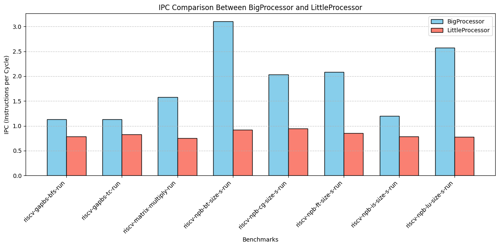
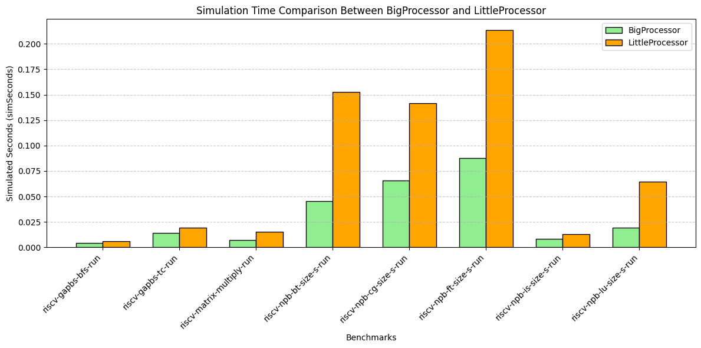
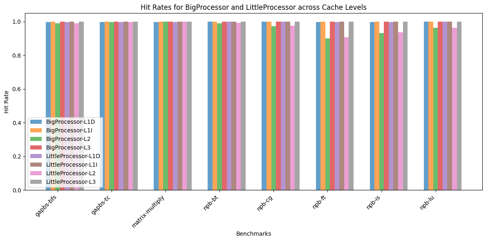

# Simulation Results

## 1. Comparison of IPC Between Processors

_Figure 1_: The bar chart above compares the **Instructions Per Cycle (IPC)** of the `BigProcessor` and `LittleProcessor` across various benchmarks.

---

## 2. Comparison of SimSeconds Between Processors

_Figure 2_: The bar chart above compares the **Simulated Time (simSeconds)** of the `BigProcessor` and `LittleProcessor` across the same set of benchmarks.

---

## 3. Comparison of Cache Hit Rates Between Processors

_Figure 2_: The bar chart above compares the **Simulated Time (simSeconds)** of the `BigProcessor` and `LittleProcessor` across the same set of benchmarks.

---

It is clear to see, from the IPC comparison chart as well as from the SimSeconds comparison chart, that the big processor is clearly more efficient than the little processor. It consistently issues more instructions per cycle and takes considerably less time, especially in benchmarks such as the Block Tri-diagonal solver, Conjugate Gradient, Lower-Upper Gauss-Seidel solver and discrete 3D fast Fourier Transform, where the execution time for the little processor is double that of the big processor. However, the non intensive workloads seem to perform similar for both processors, such as BFS, Integer Sort and Matrix Multiply.
